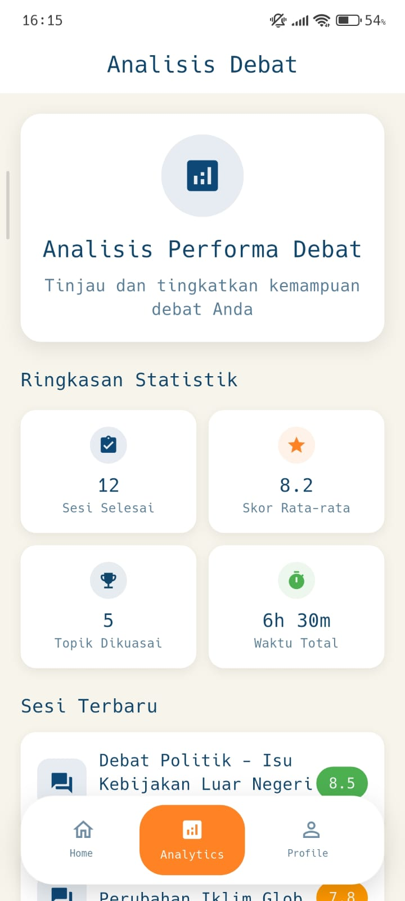

# COACH Debate

Aplikasi debat interaktif berbasis Flutter yang menggunakan Large Language Model (LLM) untuk melatih kemampuan berdebat pengguna. Aplikasi ini menyediakan platform untuk berdebat dengan AI, analisis argumen, dan pelacakan progres.

## Screenshots

<!-- Tambahkan screenshot aplikasi Anda di sini -->
<!-- Buat folder 'screenshots' di root project dan simpan gambar-gambar di sana -->

<div align="center">
  
  
  
</div>

<div align="center">

  
  
  
</div>
<div align="center">
  
  
  
</div>

## 📋 Deskripsi

COACH Debate adalah aplikasi mobile yang dirancang untuk membantu pengguna meningkatkan kemampuan berdebat mereka melalui interaksi dengan AI. Aplikasi ini mengintegrasikan teknologi Speech-to-Text, Text-to-Speech, dan LLM untuk memberikan pengalaman debat yang realistis dan interaktif.

## ✨ Fitur Utama

- **🔐 Autentikasi Pengguna**: Sistem login dan registrasi dengan Supabase
- **💬 Debat Interaktif**: Berdebat secara real-time dengan AI berbasis LLM
- **🎤 Speech-to-Text**: Konversi suara ke teks untuk input argumen
- **🔊 Text-to-Speech**: Output suara dari respons AI
- **📊 Analisis Debat**: Evaluasi dan analisis argumen pengguna
- **📚 Topik Debat**: Berbagai topik debat yang dapat dipilih
- **👤 Profil Pengguna**: Manajemen profil dan tracking progress

## 🏗️ Arsitektur

Aplikasi ini dibangun menggunakan **Clean Architecture** dengan struktur sebagai berikut:

```
lib/
├── core/                    # Core utilities dan konfigurasi
│   ├── config/             # Konfigurasi aplikasi
│   ├── error/              # Error handling
│   ├── router/             # Routing dengan GoRouter
│   └── theme/              # Theme dan styling
├── features/               # Fitur-fitur utama
│   ├── Analis/            # Analisis debat
│   ├── Auth/              # Autentikasi
│   ├── Debate/            # Sesi debat
│   ├── Home/              # Halaman utama
│   ├── Profile/           # Profil pengguna
│   ├── Stt/               # Speech-to-Text
│   └── Topics/            # Topik debat
├── shared/                 # Komponen bersama
│   ├── data/
│   ├── domain/
│   ├── presentation/
│   └── utils/
├── injection.dart          # Dependency Injection
└── main.dart              # Entry point
```

### 📐 Prinsip Clean Architecture

Project ini mengikuti prinsip **Clean Architecture** dengan pemisahan tanggung jawab menjadi **3 layer utama**:

#### 1. **Presentation Layer** (Layer UI/Tampilan)

- **Tanggung Jawab**: Menampilkan data kepada pengguna dan menangani interaksi user
- **Komponen**:
  - **BLoC**: State management untuk mengelola state dan events
  - **Pages**: Halaman-halaman aplikasi
  - **Widgets**: Komponen UI yang dapat digunakan kembali
- **Dependency**: Hanya bergantung pada Domain Layer
- **Contoh**: `auth_bloc.dart`, `login_page.dart`, `custom_button.dart`

#### 2. **Domain Layer** (Layer Logika Bisnis)

- **Tanggung Jawab**: Mengandung logika bisnis murni aplikasi
- **Komponen**:
  - **Entities**: Objek bisnis (model murni tanpa serialization)
  - **Repository Interfaces**: Kontrak untuk operasi data
  - **Use Cases**: Aksi bisnis spesifik (single responsibility)
- **Dependency**: Tidak bergantung pada layer lain (pure Dart)
- **Contoh**: `auth_entity.dart`, `auth_repository.dart`, `sign_in_usecase.dart`

#### 3. **Data Layer** (Layer Infrastruktur)

- **Tanggung Jawab**: Menangani semua operasi terkait data
- **Komponen**:
  - **Models**: Data model dengan JSON serialization
  - **Data Sources**: Remote (API) dan Local (Cache)
  - **Repository Implementation**: Implementasi konkret dari interface domain
- **Dependency**: Bergantung pada Domain Layer
- **Contoh**: `auth_model.dart`, `auth_remote_datasource.dart`, `auth_repository_impl.dart`

### 🗂️ Penjelasan Struktur Folder

#### **core/** - Konfigurasi Inti Aplikasi

```
core/
├── config/          # Konfigurasi aplikasi (API endpoints, constants)
├── error/           # Error handling (Failure classes, exceptions)
├── router/          # Navigasi dan routing (GoRouter setup)
└── theme/           # Theme dan styling (colors, typography)
```

**Fungsi**: Menyediakan fondasi dan konfigurasi global yang digunakan di seluruh aplikasi. Core module tidak bergantung pada fitur manapun dan dapat digunakan oleh semua layer.

#### **features/** - Fitur Modular

Setiap fitur di dalam folder `features/` mengikuti struktur Clean Architecture yang sama:

```
Feature/
├── data/
│   ├── datasources/        # Remote & Local data sources
│   │   ├── feature_remote_datasource.dart
│   │   └── feature_local_datasource.dart (opsional)
│   ├── models/             # Data models dengan JSON serialization
│   │   ├── feature_model.dart
│   │   └── feature_model.g.dart (generated)
│   └── repositories/       # Implementasi repository
│       └── feature_repository_impl.dart
├── domain/
│   ├── entities/           # Business objects (pure Dart)
│   │   └── feature_entity.dart
│   ├── repositories/       # Repository interfaces (contracts)
│   │   └── feature_repository.dart
│   └── usecases/          # Business logic operations
│       ├── get_feature_usecase.dart
│       └── update_feature_usecase.dart
└── presentation/
    ├── bloc/              # State management
    │   ├── feature_bloc.dart
    │   ├── feature_event.dart
    │   └── feature_state.dart
    ├── pages/             # Halaman aplikasi
    │   └── feature_page.dart
    └── widgets/           # Custom widgets
        └── feature_widget.dart
```

##### **Penjelasan Per Fitur:**

**1. Auth (Autentikasi)**

- **Data**: Integrasi dengan Supabase Auth untuk login, register, logout
- **Domain**: Entities untuk User, UseCases untuk operasi auth
- **Presentation**: AuthBloc, halaman Login/Register

**2. Debate (Debat dengan AI)**

- **Data**: Chat API datasource, Chat model dengan message history
- **Domain**: Chat entity, SendMessage & CreateSession use cases
- **Presentation**: DebateBloc, chat interface, message bubbles

**3. Topics (Topik Debat)**

- **Data**: NewsAPI integration untuk mengambil topik dari berita
- **Domain**: Topic entity, GetTopics use case dengan filter kategori
- **Presentation**: TopicsBloc, topic cards, category filters

**4. History (Riwayat Debat)**

- **Data**: History API untuk CRUD operations riwayat debate
- **Domain**: History entity dengan nested messages, Get/Delete use cases
- **Presentation**: HistoryBloc, history list, detail view

**5. Profile (Profil Pengguna)**

- **Data**: Supabase user metadata untuk menyimpan profil
- **Domain**: Profile entity, Fetch & Update profile use cases
- **Presentation**: ProfileBloc, profile page, edit form

**6. Stt (Speech-to-Text)**

- **Data**: Wrapper package speech_to_text
- **Domain**: STT entity untuk state recognition, Init/Start/Stop use cases
- **Presentation**: SttBloc, mic button, recording indicator

**7. Analis (Analisis Debat)**

- **Data**: Mengambil dan mengolah data dari History untuk statistik
- **Domain**: Analytics entity, GetAnalytics & GetRecentSessions use cases
- **Presentation**: AnalisBloc, dashboard dengan cards dan charts

**8. Home (Halaman Utama)**

- **Fungsi**: Landing page dengan quick access ke fitur utama
- **Minimal setup**: Hanya presentation layer untuk navigasi

#### **shared/** - Komponen Bersama

```
shared/
├── data/              # Shared models, datasources
├── domain/            # Shared entities, repositories
├── presentation/      # Reusable widgets, common UI components
└── utils/            # Helper functions, extensions, constants
```

**Fungsi**: Menyediakan komponen yang digunakan oleh berbagai fitur untuk menghindari duplikasi kode.

#### **injection.dart** - Dependency Injection

Mengelola semua dependencies menggunakan **GetIt** sebagai service locator:

- Registrasi BLoC, UseCases, Repositories, DataSources
- Singleton pattern untuk services yang shared
- Memudahkan testing dengan dependency injection

#### **main.dart** - Entry Point

Titik awal aplikasi yang:

- Inisialisasi Supabase dan environment variables
- Setup dependency injection
- Konfigurasi routing dengan GoRouter
- Provide BLoC untuk state management global

### 🔄 Data Flow dalam Clean Architecture

```
User Interaction (UI)
        ↓
   Presentation Layer (BLoC)
        ↓
   Domain Layer (UseCase)
        ↓
   Domain Layer (Repository Interface)
        ↓
   Data Layer (Repository Implementation)
        ↓
   Data Layer (DataSource - API/Local)
        ↓
   External (Supabase, NewsAPI, etc.)
```

### ✅ Keuntungan Clean Architecture

1. **Separation of Concerns**: Setiap layer memiliki tanggung jawab yang jelas
2. **Testability**: Mudah membuat unit test untuk setiap layer
3. **Maintainability**: Perubahan di satu layer tidak mempengaruhi layer lain
4. **Scalability**: Mudah menambah fitur baru tanpa merusak kode existing
5. **Independence**: Domain layer tidak bergantung pada framework atau library eksternal
6. **Reusability**: Use cases dapat digunakan di berbagai presentation layer

## 🛠️ Teknologi yang Digunakan

### Framework & Language

- **Flutter**: Framework utama (SDK ^3.9.0)
- **Dart**: Bahasa pemrograman

### State Management

- **flutter_bloc** (^9.1.1): State management dengan BLoC pattern
- **equatable** (^2.0.7): Equality comparison untuk state

### Backend & Database

- **supabase_flutter** (^2.10.0): Backend-as-a-Service
- **dio** (^5.9.0): HTTP client untuk API calls
- **http** (^1.5.0): HTTP package alternatif

### Speech & Audio

- **speech_to_text** (^7.3.0): Konversi suara ke teks
- **flutter_tts** (^4.2.3): Text-to-Speech

### Navigation & UI

- **go_router** (^16.1.0): Deklaratif routing
- **liquid_glass_renderer** (^0.1.1-dev.10): Efek visual

### Utilities

- **get_it** (^8.2.0): Dependency Injection
- **dartz** (^0.10.1): Functional programming (Either, Option)
- **flutter_dotenv** (^6.0.0): Environment variables
- **logger** (^2.6.1): Logging

## 📦 Instalasi & Menjalankan Project

### Prasyarat

Pastikan Anda sudah menginstall tools berikut:

- **Flutter SDK** version ^3.9.0 atau lebih tinggi - [Install Flutter](https://docs.flutter.dev/get-started/install)
- **Dart SDK** ^3.9.0 (sudah include dalam Flutter)
- **Android Studio** atau **VS Code** dengan ekstensi Flutter
- **Git** untuk clone repository
- **Akun Supabase** (gratis) - [Daftar di sini](https://supabase.com)

### Langkah-langkah Clone & Setup

#### 1. **Verifikasi Instalasi Flutter**

Pastikan Flutter sudah terinstall dengan benar:

```bash
flutter doctor
```

Pastikan semua komponen yang diperlukan sudah terinstall (tandai ✓).

#### 2. **Clone Repository**

Clone project dari GitHub:

```bash
git clone https://github.com/Ghozi-Waridi/COACH_Debate.git
cd choach_debate
```

Atau jika menggunakan SSH:

```bash
git clone git@github.com:Ghozi-Waridi/COACH_Debate.git
cd choach_debate
```

#### 3. **Install Dependencies**

Install semua package yang diperlukan:

```bash
flutter pub get
```

Tunggu hingga proses selesai. Jika ada error, jalankan:

```bash
flutter clean
flutter pub get
```

#### 4. **Setup Backend (Supabase)**

**Penting**: Project ini memerlukan backend untuk berfungsi dengan baik.

📌 **Link Backend**: [COACH Debate Backend Repository](https://github.com/Ghozi-Waridi/django-backend-DebateAPP)

Ikuti langkah-langkah berikut:

a. **Buat Project Supabase**

- Buka [Supabase Dashboard](https://app.supabase.com)
- Klik "New Project"
- Isi nama project, database password, dan region
- Tunggu hingga project selesai dibuat

b. **Dapatkan Credentials**

- Di Supabase Dashboard, pergi ke **Settings** → **API**
- Copy **Project URL** (sebagai `SUPABASE_URL`)
- Copy **anon public** key (sebagai `SUPABASE_KEY`)

c. **Setup Database & Functions**

- Clone dan setup backend sesuai instruksi di [Backend Repository](https://github.com/Ghozi-Waridi/COACH_Debate_Backend) [ NOTE : Msih Terjadi Error 😭😭]
- Deploy Edge Functions untuk AI debat
- Setup database tables dan security policies

#### 5. **Konfigurasi Environment Variables**

Buat file `.env` di **root project** (sejajar dengan pubspec.yaml):

```bash
touch .env
```

Isi file `.env` dengan credentials Supabase Anda:

```env
SUPABASE_URL=https://your-project.supabase.co
SUPABASE_KEY=your-anon-key-here
```

⚠️ **Penting**:

- Jangan commit file `.env` ke Git (sudah ada di `.gitignore`)
- Pastikan format URL benar dan tidak ada spasi
- Gunakan `anon key` bukan `service_role key`

#### 6. **Setup Device/Emulator**

**Untuk Android:**

```bash
# Cek device yang tersedia
flutter devices

```

**Untuk Physical Device:**

- Enable USB Debugging di Android
- Hubungkan device via USB
- Verifikasi dengan `flutter devices`

#### 7. **Jalankan Aplikasi**

Jalankan aplikasi di device/emulator:

```bash
# Mode debug
flutter run

# Atau pilih device spesifik
flutter run -d <device_id>

# Mode release (lebih cepat)
flutter run
```

#### 8. **Verifikasi**

Setelah aplikasi berjalan:

- ✅ Buka aplikasi dan coba fitur Register
- ✅ Test login dengan akun yang baru dibuat
- ✅ Coba fitur Speech-to-Text (izinkan permission microphone)
- ✅ Pilih topik dan mulai debat
- ✅ Pastikan AI merespons dengan baik

### ⚠️ Limit & Quota

**Request Limit**: 1000 token per request

- Setiap pesan debat dibatasi maksimal **1000 token**
- Untuk pesan yang lebih panjang, akan dipotong otomatis
- Token dihitung berdasarkan jumlah kata dan karakter
- Saran: Buat argumen yang concise dan focused (200-500 kata)

**Supabase Free Tier Limits**:

- 500MB database storage
- 1GB file storage
- 50,000 monthly active users
- 2GB bandwidth

Untuk production, pertimbangkan upgrade plan jika usage melebihi limit.

### 🐛 Troubleshooting

**Problem**: Error "SUPABASE_URL not found"

- **Solution**: Pastikan file `.env` ada dan formatnya benar

**Problem**: Build failed Android

- **Solution**:
  ```bash
  cd android
  ./gradlew clean
  cd ..
  flutter clean
  flutter pub get
  flutter run
  ```

**Problem**: Speech-to-Text tidak bekerja

- **Solution**: Pastikan permission microphone sudah diizinkan di device settings

**Problem**: AI tidak merespons

- **Solution**:
  - Cek koneksi internet
  - Pastikan backend sudah di-deploy
  - Verify Supabase credentials di `.env`

### 📚 Resource Tambahan

- [Flutter Documentation](https://docs.flutter.dev/)
- [Supabase Documentation](https://supabase.com/docs)
- [Backend Repository](https://github.com/Ghozi-Waridi/django-backend-DebateAPP)

## 📱 Fitur Detail

### 1. Autentikasi (Auth)

- Sign Up dengan email dan password
- Sign In untuk pengguna terdaftar
- Sign Out
- Get current user session
- Integrasi dengan Supabase Authentication

### 2. Debate (Debat)

- Membuat sesi debat baru
- Mengirim pesan/argumen
- Menerima respons dari AI
- Real-time conversation
- History percakapan

### 3. Speech-to-Text (STT)

- Inisialisasi speech recognition
- Mulai mendengarkan input suara
- Berhenti mendengarkan
- Stream hasil recognition
- Konversi real-time

### 4. Topics (Topik)

- Daftar topik debat yang tersedia
- Pilih topik untuk memulai debat
- Kategori topik yang beragam

### 5. Profile (Profil)

- Melihat profil pengguna
- Update informasi profil
- Tracking statistik debat

### 6. Analysis (Analisis)

- Analisis kualitas argumen
- Feedback dan saran perbaikan
- Visualisasi performa

## 🔧 Konfigurasi

### Supabase Setup

1. Buat project di [Supabase](https://supabase.com)
2. Dapatkan URL dan Anon Key dari project settings
3. Masukkan ke file `.env`

### Android Permissions

Permissions yang diperlukan (sudah dikonfigurasi di `AndroidManifest.xml`):

- Internet access
- Microphone access (untuk Speech-to-Text)
- Audio recording

## 📝 Dependency Injection

Aplikasi menggunakan **GetIt** untuk dependency injection. Semua dependencies didaftarkan di `lib/injection.dart`:

- **Repositories**: Interface dan implementasi
- **Datasources**: Remote dan local data sources
- **Usecases**: Business logic
- **BLoCs**: State management
- **External services**: Dio, Supabase client

## 🎨 Styling

- Material Design components
- Custom theme configuration
- Adaptive UI untuk berbagai ukuran layar
- Glass morphism effects dengan liquid_glass_renderer

## 📄 Lisensi

Project ini bersifat private dan tidak dipublikasikan ke pub.dev.

## 👥 Kontribusi

Untuk berkontribusi pada project ini:

1. Fork repository
2. Buat branch fitur (`git checkout -b feature/AmazingFeature`)
3. Commit perubahan (`git commit -m 'Add some AmazingFeature'`)
4. Push ke branch (`git push origin feature/AmazingFeature`)
5. Buat Pull Request

## 📞 Kontak

GitHub: [@Ghozi-Waridi](https://github.com/Ghozi-Waridi)

Repository: [COACH_Debate](https://github.com/Ghozi-Waridi/COACH_Debate)

## 🙏 Acknowledgments

- Flutter Team untuk framework yang luar biasa
- Supabase untuk backend infrastructure
- Komunitas Flutter Indonesia

---

**Built with ❤️ using Flutter**
